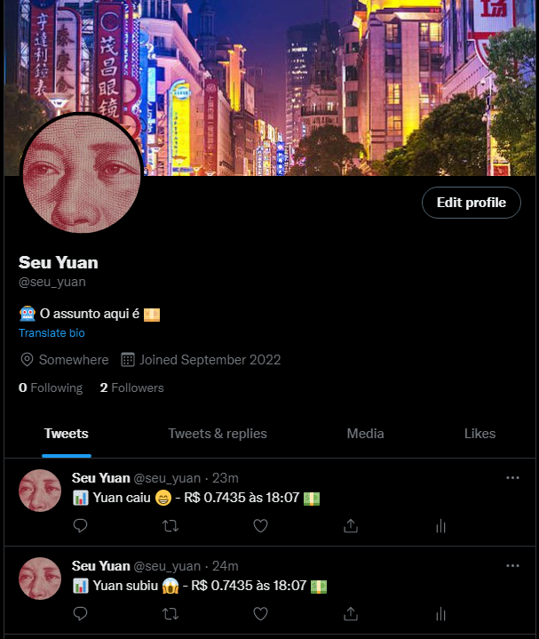

# Yuan Quote Twitter Bot

## Deployed bot and Features


### <a href='https://twitter.com/seu_yuan'>follow "Seu Yuan" on twitter</a>

### What this Bot do:
<ul style="height=270px">
  <li>Informs if the renminbi quote has increased or decreased</li>
  <li>Shows actual value of Renminbi</li>
  <li>Shows the quotation hour</li>
</ul>

<br><br><br><br><br><br><br><br><br><br>

## How to set up

te run this bot do you need to create `.env` file and set enviroment variables named:

``` js
  //obtained after generate in your app settings
  ACCESS_TOKEN= "<Your app token>"
  ACCESS_TOKEN_SECRET= "<Your app token secret>"

  //obtained when create dev account on twitter
  API_KEY= "<Your API key>"
  SECRET= "<Your secret key>"
```


